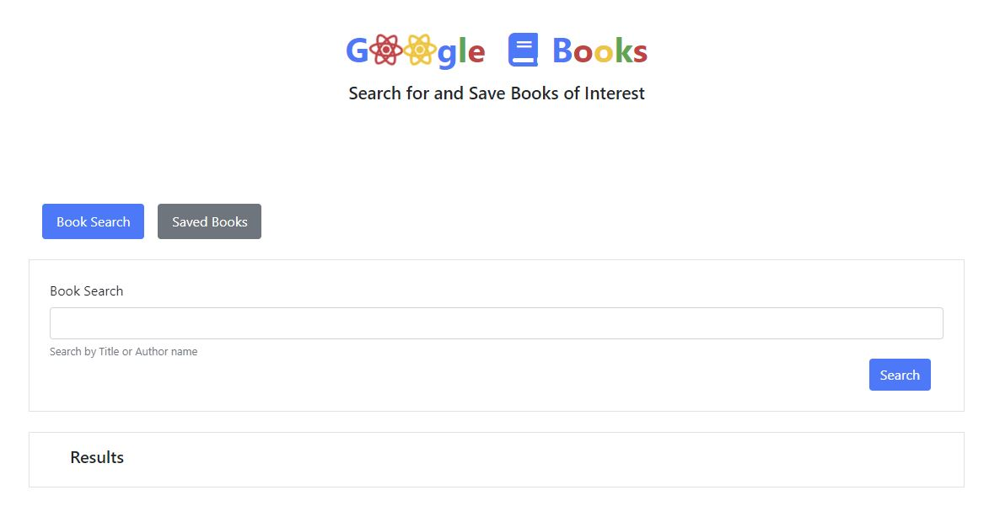
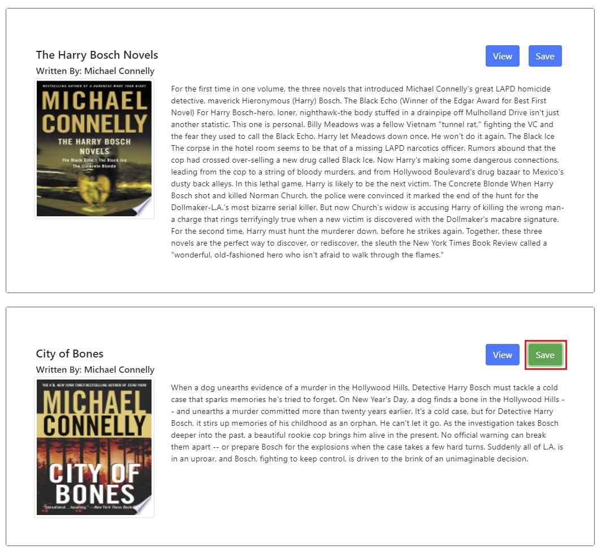

# book-search
A React application that scrapes "Google Book Search" and displays a list of books based on the search. You can choose to "Save" the book information in a mongo db for future reference.

## Deployed Application:
https://my-google-booksearch.herokuapp.com/

## Technologies
* Bootstrap framework (React-Bootstrap)
* Mongoose
* MongoDB
* Express.js
* React.js
* Node.js
* Axios
 
## Screenshots

 

## Contributors
* Steve Thompson (sthmpsn)
